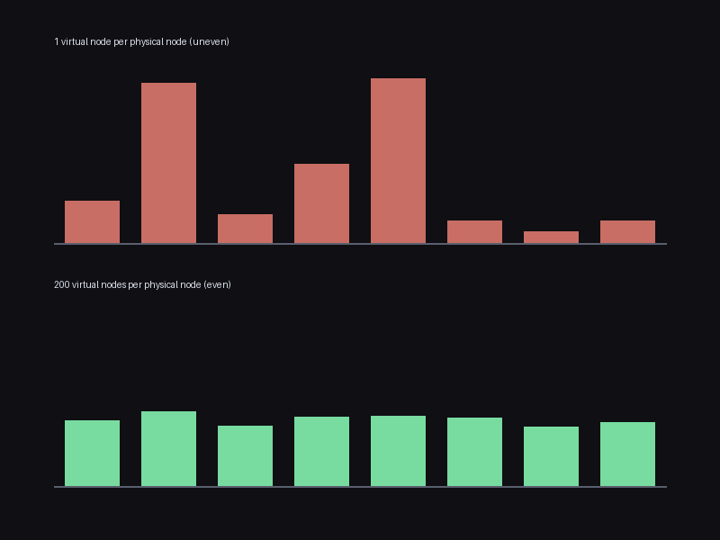

# chash

Consistent hashing with virtual nodes — the routing scheme behind
distributed caches and databases (memcached clients, Dynamo, Cassandra)
that lets you add or remove a node without reshuffling almost every key.
`chash/` has zero dependencies; `main.py` uses Pillow only to draw a
chart.

```bash
python3 main.py --seed 0 --output load_distribution.png
```

```
[disruption]  10 -> 11 nodes, 20000 keys
              consistent hashing remapped 9.0%  (theoretical ~9.1%)
              naive mod-n hashing remapped 90.8%
[uniformity]  1 vnode/node:   coefficient of variation = 0.950
              200 vnodes/node: coefficient of variation = 0.079
```



## The correctness proof: quantified, not just described

Consistent hashing is usually explained qualitatively ("adding a node
only affects nearby keys"). Here it's checked as an exact, quantified
prediction instead:

- **Minimal disruption is a hard property, not a tendency**: when a new
  node is added, `test_adding_a_node_only_ever_reassigns_keys_to_the_new_node`
  checks that *every* key whose assignment changed was reassigned
  specifically to the new node — never bounced to some unrelated
  existing node — across 60 randomized ring configurations. The same
  holds symmetrically for removal.
- **The disruption *fraction* matches the textbook formula**: adding one
  node to an n-node ring should remap close to `1/(n+1)` of all keys.
  `test_minimal_disruption_close_to_theoretical_1_over_n_plus_1` checks
  this on 20,000 keys and lands within a generous band of the exact
  prediction — the demo above landed at 9.0% against a predicted 9.1%.
- **Naive `hash(key) % len(nodes)` is checked as the losing contrast,
  not just asserted to be worse**: on the same node-count change, it's
  measured directly at 90.8% remapped — over ten times worse than the
  ring's actual result, not a hypothetical.
- **Virtual nodes measurably fix load imbalance**: with one ring
  position per physical node, load across 8 nodes has a coefficient of
  variation (stdev/mean) of 0.95 — some nodes get 3x the keys of others,
  visible directly in the chart above. With 200 virtual positions per
  physical node, that drops to 0.079, checked directly rather than
  assumed.
- **`get_node` is cross-checked against an independently-coded
  brute-force linear scan** (`brute_force.py`, no `bisect`, no
  maintained sorted list — recomputes every virtual node position fresh
  on every call) across 150 randomized ring configurations, to catch any
  off-by-one in the maintained sorted-list version's wraparound logic.

No bugs turned up in `ring.py` itself this time — like `life` and unlike
most of this collection, every property held on the first implementation
that compiled. Worth saying plainly, since most of this collection's
READMEs report something that broke.

## Architecture

```
chash/
  hashing.py       ring_hash: maps any string to a position on a 64-bit ring
  ring.py           ConsistentHashRing: add_node, remove_node, get_node
  naive.py          naive_route: hash(key) % len(nodes), for contrast
  brute_force.py    an independently-coded linear-scan oracle, tests only
```

## Usage

```python
from chash import ConsistentHashRing

ring = ConsistentHashRing(virtual_nodes_per_physical=150)
ring.add_node("cache-1")
ring.add_node("cache-2")
ring.add_node("cache-3")

ring.get_node("user:42")   # 'cache-2', say -- stable until the ring changes

ring.add_node("cache-4")   # only ~1/4 of keys move, and only to cache-4
```

## Tests

```bash
pip install -r requirements.txt
python3 -m pytest
```

379 tests: brute-force cross-checks across 150 randomized ring
configurations, the "only the new/removed node's keys move" structural
property across 60 configurations each for add and remove, the
theoretical `1/(n+1)` disruption-fraction check, the naive-hashing
contrast, and the virtual-node load-uniformity comparison.

## Possible expansions

- Weighted nodes (give some physical nodes more virtual positions than
  others, proportional to capacity) with a check that load splits in
  the intended ratio
- A comparison against rendezvous hashing (highest random weight), which
  gets the same minimal-disruption property through a completely
  different mechanism — no ring, no virtual nodes, just an argmax over a
  hash per candidate node — and would make a good independent
  cross-check target for `get_node` itself
- Bounded-load consistent hashing (cap how much any one node can receive
  before overflow spills to the next ring position), which turns the
  load-uniformity property from probabilistic into guaranteed
