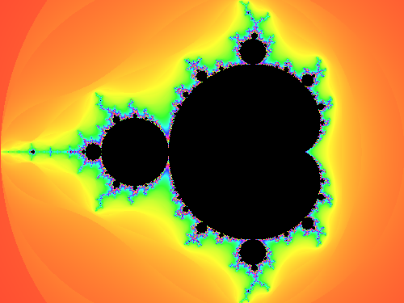
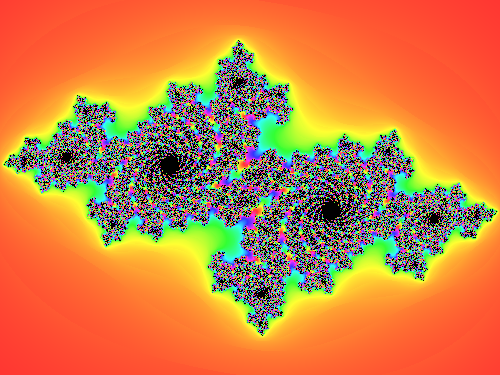
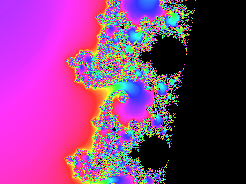

# fractal

Escape-time Mandelbrot and Julia set rendering with smooth (continuous)
coloring, in pure Python — no dependencies beyond the built-in `complex`
type for the actual math.

```bash
python3 main.py --mode mandelbrot --width 800 --height 600 --output mandelbrot.png
```

| Mandelbrot | Julia (`dendrite` preset) |
|---|---|
|  |  |

Zoomed into the boundary near c ≈ -0.745 + 0.113i:



## The correctness proof: hand-derived facts, not a reference implementation

There's no obvious external oracle for "is this pixel colored
correctly" the way `hashlib` is for SHA-256 or `sqlite3` is for SQL. So
the proof here is a set of facts about specific points and about the
Mandelbrot set's own structure, each derivable by hand independently of
trusting the escape-time loop:

- **c = 0** never escapes, for any `max_iter` — the orbit stays exactly
  `0` forever (`0² + 0 = 0`).
- **c = -1** has an *exact* period-2 orbit: `0, -1, 0, -1, ...` — it can
  never cross the bailout radius, for any `max_iter`, not just a large
  one.
- **c = 1**: the orbit `0, 1, 2, 5` is small enough to compute by hand.
  `|2|` isn't past bailout (`> 2` is strict), `|5|` is — so it escapes
  after exactly 3 applications, with a smooth value that's a fully
  hand-computable function of that (`3 - log(log(5)/log(2))/log(2)`,
  not just "somewhere in a plausible-looking range" — an earlier version
  of this test guessed a range and got it wrong; see below).
- **The main cardioid and period-2 bulb** have their own closed-form
  membership formulas (the standard ones from Mandelbrot-set literature),
  completely independent of iterating anything. Points sampled from
  *inside* those regions (via their own parametrizations, not by
  randomly sampling and filtering through the same formula being tested)
  must never escape, checked against escape-time up to 3,000-5,000
  iterations across hundreds of random points.
- **Conjugate symmetry**: `z → z² + c` commutes with complex
  conjugation, so `c` and `conj(c)` must have *identical* escape
  behavior — a structural invariant of the whole set, checked across
  300 random points, independent of any single point's known behavior.

## An honest floating-point limitation, found by a test that was too strict

`z → z² + c` with `c = 0` and `z_0` on the unit circle is exactly the
angle-doubling map (`z_n = e^{i·2ⁿθ}`) — a textbook example of a
chaotic dynamical system. In exact arithmetic, `|z_0| = 1` implies
`|z_n| = 1` forever, so it should never escape. The first version of
`test_z0_on_unit_circle_with_c_zero_never_escapes` asserted exactly
that, up to `max_iter=5000` — and failed: some starting angles escaped
around iteration 54.

That's not a bug in `escape_iterations`. Squaring a value with relative
floating-point error `ε` roughly *doubles* that relative error each
step (`(1+ε)² ≈ 1+2ε`), and double-precision floats carry about 2⁻⁵²
of headroom — so `2ⁿ · 2⁻⁵² ≈ 1` right around `n ≈ 52`, which is exactly
where the numerically-tracked orbit stops resembling the true one.
That's the real chaos in the system (sensitive dependence on initial
conditions is the defining property of a chaotic map) showing up as a
concrete, measurable floating-point limit, not something to paper over.
The test now uses `max_iter=35`, comfortably inside the region where
double precision can still track the true orbit, and the module
docstring — plus the test itself — explains why the bound is there
rather than 5000.

Two more test bugs surfaced alongside it while writing these checks:
`test_c_one_escapes_at_the_hand_computed_iteration` and its `c=2`
sibling originally asserted the smooth-value correction term always
falls in `(0, 1)`. It doesn't — for an orbit that overshoots the
bailout radius by a lot (as both of these small hand-picked examples
do), the correction can exceed 1, pushing the smooth result below
`n - 1`. Fixed by computing the exact expected value from the formula
instead of guessing a range.

## Architecture

```
fractal/
  mandelbrot.py    escape_iterations() (smooth escape-time), plus the
                     closed-form main-cardioid/period-2-bulb tests
  julia.py           the same escape-time iteration with c fixed and
                       z_0 varying per pixel instead
  color.py             hand-rolled HSV->RGB (checked against the
                          stdlib colorsys module as a test oracle) and
                          the iteration-count-to-color palette
  render.py             maps a viewport (center + width in the complex
                          plane) to a grid of RGB pixels
```

## Usage

```bash
python3 main.py --mode mandelbrot --center-re -0.745 --center-im 0.113 \
    --plane-width 0.02 --max-iter 800 --output zoom.png
python3 main.py --mode julia --julia-preset rabbit --output julia.png
```

| Flag | Meaning |
|---|---|
| `--mode` | `mandelbrot` or `julia` |
| `--julia-preset` | `dendrite`, `rabbit`, `spiral`, or `dust` (a fixed `c` value) |
| `--center-re` / `--center-im` | viewport center in the complex plane |
| `--plane-width` | how much of the complex plane the image spans horizontally (smaller = more zoomed in) |
| `--max-iter` | escape-time iteration cap (raise this when zooming in, or the boundary detail turns to noise) |
| `--cycle` | how many escape-iterations one full color cycle spans |

Or as a library:

```python
from fractal import render_mandelbrot, mandelbrot_escape_iterations

pixels = render_mandelbrot(800, 600, center=-0.5+0j, plane_width=3.0, max_iter=500)
mandelbrot_escape_iterations(-1+0j, max_iter=1000)  # None -- period-2 orbit, never escapes
```

`main.py` uses Pillow only to write the PNG; the fractal math itself
(everything under `fractal/`) has zero dependencies.

## Tests

```bash
pip install -r requirements.txt
python3 -m pytest
```

1,668 tests: the closed-form Mandelbrot facts described above (including
500 randomized cardioid-membership and bulb-membership cross-checks,
300 randomized conjugate-symmetry checks, and the two corrected
hand-computed-orbit tests), the equivalent Julia-set checks (including
the floating-point chaos finding), HSV→RGB against `colorsys` across
500 random trials, and viewport-to-complex-plane pixel mapping
(aspect ratio, orientation, centering).

## Possible expansions

- Interior distance estimation for genuinely smooth boundary detail when
  deeply zoomed in, instead of raising `max_iter` (which only delays,
  rather than eliminates, the point where detail turns to noise)
- Arbitrary-precision arithmetic for zooms deep enough that double
  precision itself runs out of resolution (a different, unavoidable
  floating-point limit than the chaos one described above — this one is
  about the *center point's* precision, not the iteration's)
- Buddhabrot-style rendering (accumulating orbit *density* across many
  starting points, rather than coloring by escape time per point)
