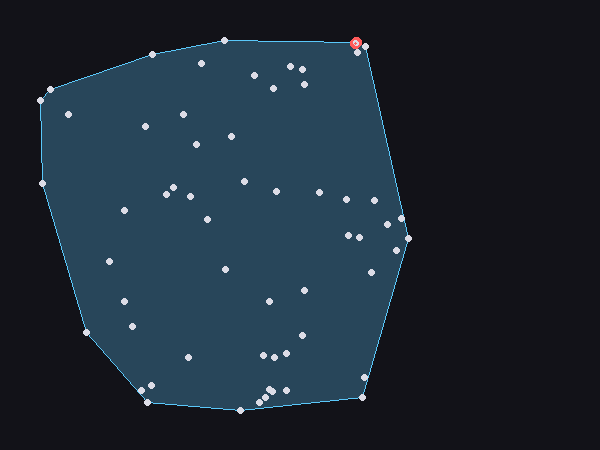

# geometry

A small computational geometry library: convex hull, closest pair of
points, point-in-polygon, and segment intersection. No dependencies.

```bash
python3 main.py --points 60 --seed 3 --output hull.png
```



## The correctness proof: two independent derivations per problem

Every one of the four problems here is solved (at least) two genuinely
different ways, and the proof is simply requiring them to agree:

| Problem | Fast method | Independent check |
|---|---|---|
| Convex hull | `graham_scan` — Andrew's monotone chain, O(n log n) | `gift_wrapping` — Jarvis march, O(nh); **and** `brute_force_hull_vertices` — O(n³) direct edge testing |
| Closest pair | `closest_pair` — divide-and-conquer, O(n log n) | `brute_force_closest_pair` — O(n²) exhaustive scan |
| Point in polygon | `point_in_polygon_ray_casting` — parity of boundary crossings | `point_in_polygon_winding_number` — total signed rotation (Sunday's algorithm) |
| Segment intersection | `segments_intersect` — O(1) orientation test | `segments_intersect_parametric` — solve the 2×2 linear system directly (Cramer's rule) |

The convex hull gets three independent methods instead of two on
purpose: `graham_scan` and `gift_wrapping` are both "sweep the boundary"
algorithms, related in spirit even though the mechanics differ, so
`brute_force_hull_vertices` — which never sorts or wraps around
anything, it just tests the defining property of a hull edge directly —
is there specifically to rule out a shared blind spot between the two
sweep methods. That turned out to matter (see below).

## A real bug the third method caught

`brute_force_hull_vertices`'s first version found a hull edge by
checking, for every pair of points `(a, b)`, whether every *other*
point lies on one consistent side of the line through them — and then
added both `a` and `b` as hull vertices. That's wrong whenever a third
point lies exactly on that same line: every sub-pair among 3+ collinear
points sharing one hull edge independently passes the identical "all
others on one side" test (collinear points don't count against either
side), so the function reported the *middle* points as hull vertices
too, not just the true corners.

This didn't show up as an obviously-wrong answer — it showed up as
`graham_scan` and `gift_wrapping` (which agree with each other) suddenly
disagreeing with `brute_force_hull_vertices` on about a third of 300
random trials using coarse integer coordinates (chosen specifically to
make collinear points likely). Fixed by having the brute-force check,
once it confirms a line is a hull edge, keep only the two *extreme*
points on that line (by projection onto its own direction) rather than
naively keeping every point that happened to be part of a passing pair.

## Architecture

```
geometry/
  primitives.py              cross() / orientation() -- the one
                                primitive nearly everything else needs
  hull.py                       graham_scan, gift_wrapping,
                                  brute_force_hull_vertices
  closest_pair.py                 closest_pair, brute_force_closest_pair
  point_in_polygon.py               ray casting, winding number
  segment_intersection.py             orientation test, parametric solve
```

## Usage

```bash
python3 main.py --points 100 --seed 7 --output out.png
```

Or as a library:

```python
from geometry import graham_scan, closest_pair, point_in_polygon_ray_casting

points = [(0, 0), (4, 0), (4, 4), (0, 4), (2, 2)]
graham_scan(points)   # [(0,0), (4,0), (4,4), (0,4)] -- (2,2) is interior, excluded
closest_pair(points)  # closest pair + distance
point_in_polygon_ray_casting((2, 2), graham_scan(points))  # True
```

`main.py` uses Pillow only for drawing the demo PNG; the geometry
library itself has zero dependencies.

## Tests

```bash
pip install -r requirements.txt
python3 -m pytest
```

2,806 tests: hand-picked shapes and degenerate cases (collinear points,
duplicates, all-collinear input, 1-2 points) for the hull algorithms,
300 randomized trials cross-checking all three hull methods (including
the collinear-heavy integer-coordinate case that caught the bug above,
plus points sampled on a circle for strictly-convex position), 300+50+30
randomized/clustered/grid trials for closest pair against brute force,
500+200 randomized trials (convex and star-shaped polygons) for
point-in-polygon, and 1000+300 randomized/grid trials for segment
intersection.

## Possible expansions

- Delaunay triangulation / Voronoi diagrams (a natural next step from
  convex hulls, but a meaningfully bigger algorithm to get right)
- Polygon clipping (Sutherland-Hodgman) and polygon-polygon intersection
- A proper spatial index (k-d tree or R-tree) for nearest-neighbor
  queries beyond just "the single closest pair in the whole set"
- 3D versions of these (3D convex hull in particular is a substantially
  harder algorithm than the 2D case here)
