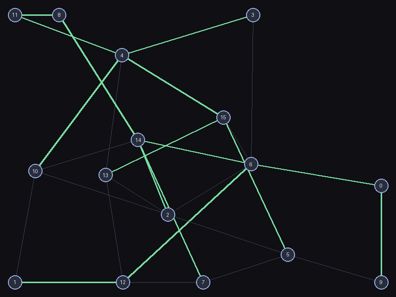
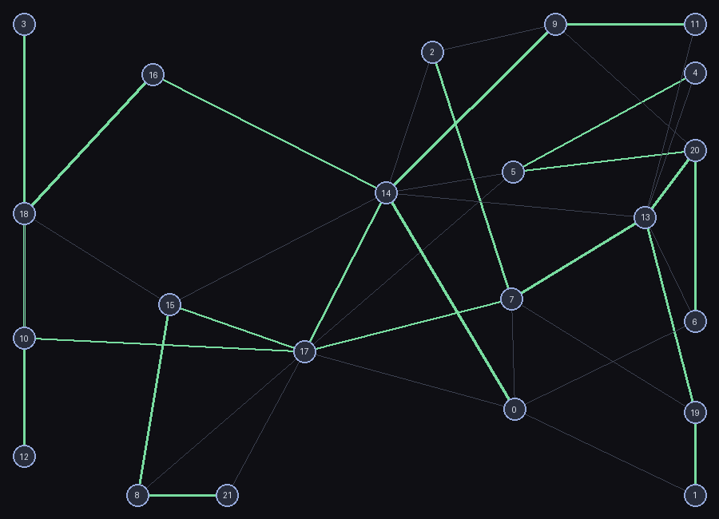

# graphs

Classic graph algorithms from scratch: shortest paths, minimum spanning
trees, max-flow/min-cut, strongly connected components, topological
sort. `graphs/` has zero dependencies; `main.py` uses Pillow only to
render a random graph to a PNG.

```bash
python3 main.py --nodes 16 --edge-prob 0.15 --seed 3 --output demo.png
```

| MST (green) over a random graph | A larger graph |
|---|---|
|  |  |

## The correctness proof: two+ independent algorithms per problem

Every problem here is solved at least two structurally different ways,
and the two are required to agree — plus, for small graphs, both are
checked against a deliberately naive brute-force oracle coded
independently of all of them.

- **Shortest paths**: `dijkstra` (greedy, heap-based, non-negative
  weights only), `bellman_ford` (relax every edge V-1 times, handles
  negative weights, detects negative cycles reachable from the source),
  and `floyd_warshall` (all-pairs dynamic programming, detects negative
  cycles anywhere). All three are required to agree on every reachable
  node's distance across hundreds of randomized graphs — non-negative
  cases get all three compared; negative-weight cases (no cycle) compare
  Bellman-Ford against Floyd-Warshall; and a from-scratch brute-force
  "enumerate every simple path" oracle backs up Dijkstra on small graphs.
- **Minimum spanning tree**: `kruskal` (global greedy over sorted edges,
  union-find for cycle detection) and `prim` (grow one tree, always take
  the cheapest frontier edge). Cross-checked on total weight across 300
  random graphs, and — since an MST is *unique* when all edge weights
  are distinct — checked for an *exact matching edge set* in that case,
  not just matching weight. Also checked against the cut property
  directly (no edge crossing an MST edge's induced cut may be cheaper
  than that edge) and against a brute-force "try every (n-1)-edge subset,
  keep the cheapest spanning one" oracle on tiny graphs.
- **Max-flow / min-cut**: `edmonds_karp` (Ford-Fulkerson with BFS
  augmenting paths) reports a flow value; `min_cut` reads a cut directly
  off the same algorithm's final residual graph. The max-flow min-cut
  theorem says these must be numerically *identical* — not approximately
  close, exactly equal, checked across 300 random DAG-shaped flow
  networks — plus a match against Cormen/Leiserson/Rivest/Stein's
  textbook example (max flow = 23) and brute-force oracles for both flow
  and cut on tiny graphs.
- **Strongly connected components**: `tarjan_scc` (single DFS pass,
  low-link tracking, an explicit component stack) and `kosaraju_scc`
  (DFS finishing order, then DFS again on the transposed graph) —
  structurally unrelated algorithms, cross-checked across 300 random
  directed graphs, plus a brute-force "two nodes share a component iff
  each can reach the other" oracle.
- **Topological sort**: `kahn_topo_sort` (repeatedly remove in-degree-zero
  nodes) is checked against `is_valid_topo_order` (every edge must point
  forward in the returned order) on 300 random DAGs, and checked to
  correctly report `None` when a cycle is deliberately introduced into
  an otherwise-valid DAG.

## A real bug this cross-checking caught

Early on, `test_kruskal_matches_prim_total_weight` failed: Kruskal and
Prim disagreed on the total MST weight for the same graph. Prim's answer
was *cheaper*, which was the first clue — Prim can't be wrong here in a
way that returns a below-minimum answer, since every edge it adds is
real. Digging in, the test's own random graph generator had accidentally
inserted **two parallel edges between the same pair of nodes with
different weights** (nothing stopped it — nothing in `Graph` forbids
multi-edges).

`Graph.edges()` — which Kruskal reads from — de-duplicated undirected
edges by unordered pair, but kept whichever parallel copy it happened to
encounter *first* while walking the adjacency dict, not the cheaper one.
Prim never goes through `edges()` at all; it walks raw adjacency lists
directly, so its heap naturally saw both parallel copies and picked the
cheaper one on its own. The fix: `edges()` now keeps the *minimum*-weight
copy among parallel edges for a given pair, not an arbitrary one. This
also matches what every other consumer implicitly wants — the "weight of
the edge between u and v" should mean the cheapest way to cross between
them, not whichever happened to be inserted first.

This is a good example of why the cross-check has to be *structural*,
not just "run it twice": two implementations that happen to read the
same broken shared data (`edges()`) the same broken way would have
agreed with each other and both been wrong. Prim avoided the bug purely
because it doesn't share that code path with Kruskal at all.

## Architecture

```
graphs/
  graph.py           Graph: adjacency-list representation, directed
                       or undirected, weighted
  shortest_path.py    dijkstra, bellman_ford, floyd_warshall
  mst.py              kruskal, prim
  maxflow.py          edmonds_karp, min_cut (reads the cut off the
                       final residual graph)
  scc.py              tarjan_scc, kosaraju_scc
  topo_sort.py        kahn_topo_sort, is_valid_topo_order
  brute_force.py      independently-coded naive oracles for tests only
```

## Usage

```python
from graphs import Graph, dijkstra, kruskal, edmonds_karp, tarjan_scc, kahn_topo_sort

g = Graph(directed=False)
g.add_edge("a", "b", 4.0)
g.add_edge("b", "c", 2.0)
g.add_edge("a", "c", 5.0)

dijkstra(g, "a")           # {'a': 0.0, 'b': 4.0, 'c': 5.0}
kruskal(g)                  # [('b', 'c', 2.0), ('a', 'b', 4.0)]
```

`main.py` generates a random weighted graph, computes its MST and
shortest paths from node 0, and renders it via a small hand-rolled
force-directed (Fruchterman-Reingold style) layout — nodes repel each
other, edges pull their endpoints together, positions relax over 400
iterations with simulated-annealing-style cooling.

## Tests

```bash
pip install -r requirements.txt
python3 -m pytest
```

2,853 tests (plus 128 intentional skips for trials whose randomly
generated graph didn't fit a particular check — e.g. a negative-cycle
trial skipped by the no-cycle comparison test, or a same-weight trial
skipped by the unique-MST check): every algorithm pair cross-checked
against each other and against independent brute-force oracles across
hundreds of randomized graphs each, plus the CLRS textbook max-flow
figure and the real parallel-edges MST bug's regression coverage.

## Possible expansions

- A* search (shortest path with a heuristic) cross-checked against
  Dijkstra on graphs where the heuristic is admissible
- Bipartite matching (Hopcroft-Karp), which reduces to max-flow and
  could be cross-checked against this package's own `edmonds_karp`
- Articulation points and bridges (a close relative of Tarjan's SCC
  low-link technique, applied to undirected graphs)
- A directed-graph variant of the force-directed renderer with
  arrowheads, for visualizing SCCs and topological order directly
