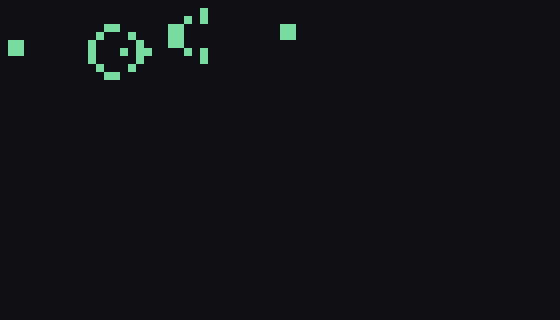

# life

Conway's Game of Life (plus configurable "Life-like" rule variants),
and Wolfram's elementary 1D cellular automata. No dependencies.

```bash
python3 main.py --mode life --pattern soup --output soup.gif
python3 main.py --mode elementary --rule 90 --output rule90.png
```

| Rule 30 | Rule 90 (Sierpinski triangle) | Rule 110 (Turing-complete) |
|---|---|---|
|  |  |  |



## The correctness proof: exact facts, not a reference implementation

**Game of Life** (`grid.py`) is checked against well-documented, exact
mathematical properties of specific named patterns, not against another
implementation:

- **Still lifes** (block, beehive, loaf, boat, tub) are exact fixed
  points: `step(pattern) == pattern`, checked bit-for-bit, and rechecked
  over 20 further generations to rule out "looks stable but slowly
  drifts."
- **Oscillators** (blinker, toad, beacon) return to their *exact*
  original frozenset after *exactly* their documented period — and
  `test_oscillator_does_not_return_before_its_claimed_period` checks
  that no smaller number of steps also returns to the start (so a
  period-2 oscillator that happened to have some spurious period-1
  behavior would be caught, not just "eventually cycles").
- **The glider** returns to its exact original shape (mod translation)
  after exactly 4 generations, translated by exactly one cell
  diagonally — checked to keep moving by that same fixed vector across
  4 further periods in a row, not just once.

`grid.py` also ships two independently-coded step functions —
`step` (accumulate neighbor counts in a dict by walking outward from
each alive cell) and `step_bruteforce` (scan every cell in an explicit
padded bounding box, checking each of its 8 neighbors one at a time via
direct set membership) — cross-checked against each other across 400+
randomized "soups" and three different birth/survival rule sets
(Conway's own B3/S23, HighLife's B36/S23, and an arbitrary made-up
rule), specifically so a transcription bug in one is unlikely to be
replicated in the other.

**The Gosper glider gun** (`GOSPER_GLIDER_GUN` in `patterns.py`) gets a
proof in the same spirit, but for a much richer claim: it's not periodic
or fixed, it grows forever, one glider at a time, every 30 generations.
`test_glider_gun.py` checks the exact closed-form consequence --
`population(30*k) == 36 + 5*k` for every k from 1 to 20, run against the
real simulation rather than assumed -- plus a direct structural check
that the extra cells really are glider-shaped: every 5-cell connected
component present at generation 300 is extracted and matched (up to
translation) against the glider's own 4 canonical rotation-free phases,
not just counted. An earlier version of the test also asserted
population never decreases generation-by-generation, which turned out
to be false and is now documented as the actual (and more interesting)
finding: population dips and recovers *within* each 30-step cycle as
the gun's internal oscillator runs, and only the once-per-cycle sampled
values are strictly increasing.

**Rule 90** (`elementary.py`) gets an even stronger proof: starting from
a single live cell, it produces *exactly* Pascal's triangle mod 2 (the
Sierpinski triangle above) — a well-known, independently provable fact
about Rule 90 that has nothing to do with how this module happens to be
coded. `test_rule_90_matches_pascals_triangle_mod_2` computes the
predicted value at every (generation, position) using Python's
exact-integer `math.comb`, a completely different computation path from
simulating the automaton cell by cell, and requires bit-for-bit
agreement across 35 generations.

## Architecture

```
life/
  grid.py         Game of Life / Life-like rules: step, step_bruteforce
                    (the cross-check), run, normalize
  patterns.py       named patterns with their documented exact properties
                     (still lifes, oscillators + periods, the glider,
                     the Gosper glider gun)
  elementary.py       Wolfram's elementary 1D CA: rule_table, step, run
```

## Usage

```bash
python3 main.py --mode life --pattern glider --width 20 --height 20 --generations 40 --output glider.gif
python3 main.py --mode life --pattern gun --width 70 --height 40 --generations 120 --output gun.gif
python3 main.py --mode elementary --rule 110 --width 120 --generations 100 --output rule110.png
```

Or as a library:

```python
from life import step, STILL_LIFES, OSCILLATORS, run_elementary, single_seed_row

step(STILL_LIFES["block"]) == STILL_LIFES["block"]  # True, forever

pattern, period = OSCILLATORS["blinker"]
# apply step() `period` times -> back to `pattern` exactly
```

`main.py` uses Pillow only for rendering GIFs/PNGs; the automata
themselves (`life/`) have zero dependencies.

## Tests

```bash
pip install -r requirements.txt
python3 -m pytest
```

602 tests: every still life, oscillator, and the glider checked against
its exact documented property, 400+ randomized cross-checks between the
two independent Game-of-Life step implementations (including non-Conway
rule sets and a bounding-box-growth invariant), the Rule 90 /
Pascal's-triangle closed-form check across 35 generations, structural
tests of the elementary CA step function (boundary handling, row-length
preservation, rule-table decoding), and the Gosper glider gun's exact
`population(30k) == 36 + 5k` closed form across k = 1..20 plus a
structural check that emitted cells really are glider-shaped.

## Possible expansions

- Hashlife (the exponential-speedup algorithm for simulating extremely
  large patterns very far into the future) — a genuinely different,
  much more involved algorithm than either step function here
- Totalistic and higher-neighborhood cellular automata beyond the
  elementary (radius-1, 2-state) rules covered here
- A second, structurally different glider gun (e.g. a period-46 or
  other known gun) cross-checked to confirm its own documented period
  and emission rate, the way the Gosper gun's is checked here
