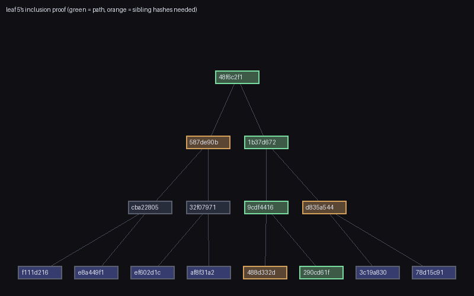

# merkle

A Merkle tree from scratch: build a tree over a list of leaves, get a
single root hash that commits to all of them, and generate small
"inclusion proofs" that let anyone with just the root verify a specific
leaf is part of the committed set. `merkle/` has zero dependencies;
`main.py` uses Pillow only to draw a diagram.

```bash
python3 main.py --output tree_diagram.png
```

```
[merkle] 8 documents committed, root = 48f6c2f12e79399d...
[tamper] document 3 silently edited ("invoice #1003: $548" -> altered) -> root = c88dfd212cb2a2be... (changed: True)
[proof]  leaf 5 verifies against the original root: True
[proof]  forged leaf 5 verifies: False
```



## The correctness proof

- **Root computation** is cross-checked against an independently-coded
  recursive oracle (`brute_force.py`, deliberately different code shape
  from `tree.py`'s iterative level-building) across 200 randomized leaf
  sets, including edge cases (1, 2, 3, 5, 7, and other non-power-of-2
  leaf counts, which are exactly where an off-by-one in the "odd node
  out" handling would show up).
- **Tamper evidence**: flipping a single bit in any one leaf, anywhere
  in the tree, changes the root — checked across 150 randomized trials
  with random victim leaves and random byte positions.
- **Proof verification is checked both ways**: every real leaf's proof
  verifies against the true root (200 trials), and forged inputs are
  correctly rejected three different ways — a wrong leaf value, a
  single tampered bit in one sibling hash inside the proof, and a
  proof checked against the wrong root entirely (150 trials each).
  `verify_proof` is deliberately a free function taking only
  `(leaf, proof, root)`, no tree object, matching how a real verifier
  — who only ever received the root — would actually use it.

## A real, historically-documented vulnerability, demonstrated with actual bytes

`hashing.py` hashes leaves and internal nodes with different one-byte
prefixes (`0x00` vs `0x01`) before SHA-256. This isn't decoration.
`test_domain_separation.py` constructs the concrete failure this
prevents: take two leaves, `A` and `B`. A naive (non-domain-separated)
two-leaf tree's root is `sha256(sha256(A) + sha256(B))`. Now consider a
*completely different*, forged single-leaf tree whose one "leaf" is the
64-byte blob `sha256(A) + sha256(B)` — under the naive scheme its root
is `sha256(sha256(A) + sha256(B))` too. **Identical root, by
construction, for two structurally unrelated datasets** — a verifier
who only ever sees "the root is R" has no way to tell a genuine 2-item
list from a forged 1-item list built purely to reproduce that root.

With the 0x00/0x01 prefixes, the two computations become
`sha256(0x01 + sha256(0x00+A) + sha256(0x00+B))` (the real node hash)
versus `sha256(0x00 + sha256(0x00+A) + sha256(0x00+B))` (the forged
leaf hash) — different first bytes, so SHA-256's actual inputs differ
and the collision is gone. `test_tree.py`'s `_build_levels` also avoids
a *second*, separate real-world Merkle bug from the same family:
odd-sized levels are promoted unchanged rather than duplicated, which
sidesteps the duplicate-last-node forgery pattern behind
[CVE-2012-2459](https://en.bitcoin.it/wiki/CVE-2012-2459) in early
Bitcoin's Merkle tree implementation.

## Architecture

```
merkle/
  hashing.py       leaf_hash, node_hash (domain-separated via 0x00/0x01 prefixes)
  tree.py           MerkleTree (build, root, proof), ProofStep, verify_proof
  brute_force.py    an independently-coded recursive root oracle, tests only
```

## Usage

```python
from merkle import MerkleTree, verify_proof

documents = [b"doc one", b"doc two", b"doc three", b"doc four", b"doc five"]
tree = MerkleTree(documents)
tree.root                              # commits to all 5 documents

proof = tree.proof(2)                  # small proof for "doc three"
verify_proof(documents[2], proof, tree.root)   # True
verify_proof(b"doc three (altered)", proof, tree.root)  # False
```

## Tests

```bash
pip install -r requirements.txt
python3 -m pytest
```

1,080 tests: the brute-force root cross-check across 200 randomized
leaf sets and every leaf count from 1 to 33 including non-powers-of-2,
the tamper-evidence check across 150 trials, the three ways a forged
proof gets rejected, and the constructed domain-separation collision
(and its absence in the real implementation) across 200 leaf pairs.
No bugs were found in `tree.py` or `hashing.py` themselves — like
`life` and `chash`, every property held on the first implementation
that compiled — though `main.py`'s own tamper-detection demo initially
used a text search-replace that happened to miss the target document
entirely, silently "proving" nothing; fixed with a guaranteed
byte-level flip instead.

## Possible expansions

- Sparse Merkle trees (fixed-depth trees over a huge, mostly-empty key
  space, used for efficient non-membership proofs) cross-checked for
  agreement with this package's dense tree on the keys that are present
- A Merkle Mountain Range (an append-only variant that avoids
  recomputing the whole tree on every insert) compared directly against
  rebuilding this package's tree from scratch after each append
- Wiring this up to `vcs` from this collection as an alternative
  integrity layer, comparing its content-addressable object store
  against a Merkle-tree-of-blobs approach directly
