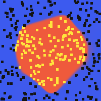
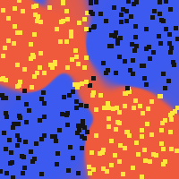

# neuralnet

A feedforward neural network from scratch: dense layers, activations,
backpropagation, and SGD — pure Python, no numpy, consistent with the
rest of this repo. The correctness proof isn't "it trained and the loss
went down" (that can look right while the gradient math is subtly wrong)
— it's **numerical gradient checking**, the standard technique for
verifying a backprop implementation independently of trusting the
calculus was transcribed correctly.

```bash
python3 main.py --task circle --output boundary.png
```

| `circle` | `xor_blobs` |
|---|---|
|  |  |

Trained on 300 random 2D points; yellow/black dots are the two classes,
background color is the network's continuous confidence. Both converge
reliably (299/300 and 291/300 training accuracy in the committed
examples).

## The correctness proof: gradient checking

For each individual weight, nudge it by `+epsilon`, measure how much the
loss actually changes, nudge by `-epsilon`, measure again — the
finite-difference `(loss_plus - loss_minus) / (2*epsilon)` is a direct,
independent estimate of `dLoss/dWeight` that never looks at `backward()`
at all. Compare that against what `backward()` claims the gradient is.
If a real bug exists — a transposed index, a missing chain-rule term, a
sign flip — the two numbers disagree, often by orders of magnitude. If
the implementation is correct, they agree to several significant figures
(limited only by floating-point precision and the choice of epsilon).

`gradcheck.py` does exactly this, across every weight and bias in a
network. Measured on a 4-layer network mixing tanh/ReLU/sigmoid
activations against both loss functions: max relative error **~2.7e-9**
— essentially machine-precision noise, not "close enough to be
suspicious." `tests/test_gradcheck.py` runs this check across single
layers, deep mixed-activation networks, both loss functions, and 10
randomly-generated architectures — and includes one test that
deliberately breaks a gradient (adds `10.0` to every weight gradient) to
confirm the checker actually *notices* when something's wrong, not just
that it always reports success.

## Architecture

```
neuralnet/
  activations.py    sigmoid (numerically stable for large |x|), relu,
                       tanh, linear -- each paired with its derivative
                       expressed in terms of its own output
  layer.py            Dense: forward + a pure backward() (computes
                        gradients without mutating weights, which is
                        exactly what makes gradient checking possible)
                        + a separate apply_gradients() for the actual
                        SGD step
  losses.py            MSE, binary cross-entropy (with epsilon-clipped
                          log to avoid log(0))
  network.py            Sequential: chains layers, train_step/train_epoch
  gradcheck.py            the correctness proof described above
```

Splitting `backward()` (pure gradient computation) from
`apply_gradients()` (the mutating SGD step) is what makes gradient
checking possible at all: you need to compute a gradient, then perturb
that exact same weight and remeasure, without the act of computing the
gradient having already changed the weight.

## An honest negative result

`main.py --task spiral` trains against two interleaved spirals — a
classic hard case for plain SGD on a small network. It does **not**
reliably converge with this architecture: training accuracy sits at
~50% (equivalent to random guessing on a balanced binary task) even with
a wider network and 2,000 epochs, confirmed reproducibly across runs.
This isn't a bug — tightly-wound spirals are a well-known stress case
used in ML pedagogy specifically to motivate why plain vanilla SGD on a
small MLP isn't enough in general, and why techniques like momentum,
adaptive learning rates (Adam), or just a bigger/deeper network matter.
No committed example image for this task, since it wouldn't show
anything working — but the task is there to try (`--task spiral`), and
this note exists so that outcome reads as documented, not silently
dropped.

## Usage

```bash
python3 main.py --task circle --seed 1 --epochs 400 --output boundary.png
```

| Flag | Meaning |
|---|---|
| `--task` | `circle`, `xor_blobs`, or `spiral` (see above) |
| `--seed` | RNG seed for both the dataset and initial weights |
| `--epochs` / `--learning-rate` | training hyperparameters |
| `--output` | output PNG path for the decision-boundary visualization |

Or as a library:

```python
import random
from neuralnet import Dense, Sequential, TANH, SIGMOID, MSE

rng = random.Random(0)
net = Sequential([Dense(2, 8, TANH, rng), Dense(8, 1, SIGMOID, rng)])
for _ in range(3000):
    net.train_step([0.0, 1.0], [1.0], MSE, learning_rate=0.5)
```

The core library (`activations.py` through `gradcheck.py`) has zero
dependencies. `main.py`'s decision-boundary visualization uses Pillow —
a demo/rendering concern, not the neural network itself.

## Tests

```bash
pip install -r requirements.txt
python3 -m pytest
```

45 tests: activation functions (including that sigmoid doesn't overflow
on extreme inputs), layer forward/backward mechanics (backward provably
doesn't mutate weights, `apply_gradients` moves weights by exactly
`-lr * gradient`), loss functions, network training (a single example's
loss provably decreases, XOR is learned to 100% accuracy, zero learning
rate leaves weights unchanged), and the gradient-checking suite described
above.

## Possible expansions

- Momentum / Adam optimizer (motivated directly by the spiral task above)
- Softmax + categorical cross-entropy for multi-class classification
- Mini-batching (currently pure online/stochastic, one example at a time)
- Convolutional layers
