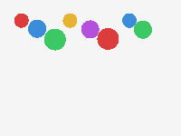

# physics2d

A 2D rigid-body physics simulation (gravity, walls, elastic circle-circle
collisions) rendered to an **animated GIF written entirely from scratch**
— including a real LZW compressor, not just the RIFF-style headers other
things in this repo hand-roll.

```bash
python3 main.py --balls 8 --output bounce.gif
```



## Physics

`world.py` integrates each body with semi-implicit Euler (`velocity +=
gravity*dt; position += velocity*dt`), then resolves two kinds of
collision every step:

- **Walls**: reflect the velocity component perpendicular to whichever
  wall was crossed, scaled by restitution, and clamp position back inside
  the bounds.
- **Circle-circle**: standard impulse resolution — compute the collision
  normal, find the relative velocity along it, and apply an equal-and-
  opposite impulse sized by combined restitution and each body's inverse
  mass (`0` for `static=True` bodies, so walls/anchors never get pushed).
  A separate positional correction nudges overlapping circles apart
  directly, which is necessary because pure impulse resolution alone lets
  fast-moving or resting bodies slowly sink into each other over many
  steps ("the ball glued to the floor" problem every physics engine
  tutorial runs into).

## The GIF encoder: a real bug, found by a real oracle

GIF's image data is LZW-compressed, and LZW encoders and decoders have a
subtle, easy-to-get-wrong contract: the decoder can only add a new
dictionary entry to its own table *one code-read later* than the encoder
adds the corresponding entry (the decoder has to see the *next* code to
know a sequence recurred; the encoder can look ahead in its input
directly). If the encoder grows its code width at the wrong moment
relative to that lag, encoder and decoder silently drift out of sync —
and Pillow's decoder threw `OSError: broken data stream` on literally the
first real GIF this encoder produced.

The fix (`gif.py::_lzw_encode`, see the comment at the growth check):
growth must happen **before** handing out a new code, checked against the
old value of `next_code`, not after incrementing it. Getting this
backwards is exactly what desynced this encoder from Pillow's decoder.

This is a fully worked example of the same lesson as `pebble`'s
for-loop/`continue` bug elsewhere in this repo: an "obviously correct"
piece of bookkeeping code had a one-step timing error that no amount of
reading the code caught, and only an external, independent oracle
(Pillow, decoding files this encoder never told it how it built them)
caught it. `tests/test_gif.py` leans on exactly that: every GIF this
encoder produces gets decoded by Pillow and checked pixel-for-pixel,
including a stress case with a 200-color palette over 6,400 pixels
specifically to exercise LZW code-width growth across its full range
and at least one mid-stream table reset.

## Architecture

```
physics2d/
  vec2.py       2D vector math
  body.py         Circle: position, velocity, radius, mass, restitution
  world.py         gravity + wall/circle collision resolution
  render.py        rasterizes circles into an RGB pixel grid
  gif.py             GIF89a writer: global color table, from-scratch LZW
                       compression, NETSCAPE2.0 loop extension
```

## Usage

```bash
python3 main.py --balls 10 --frames 120 --fps 30 --seed 1 --output bounce.gif
```

| Flag | Meaning |
|---|---|
| `--width` / `--height` | canvas size in pixels |
| `--balls` | number of circles, randomly placed and sized |
| `--frames` / `--fps` | animation length and playback speed |
| `--seed` | RNG seed for reproducible layouts |
| `--output` | output `.gif` path |

## Tests

```bash
pip install -r requirements.txt
python3 -m pytest
```

36 tests: vector math, collision behavior (walls never let a body escape
over 1000+ simulated steps, static bodies never move, momentum is
conserved in an equal-mass elastic collision, overlapping circles
separate rather than sinking into each other), the rasterizer, and the
GIF encoder's Pillow-oracle round-trip tests described above.

## Possible expansions

- Rotation / angular momentum (currently circles only translate)
- Non-circle shapes (AABB/polygon collision)
- Spatial partitioning (currently O(n²) pairwise collision checks — fine
  for a few dozen bodies, not for hundreds)
- A proper physically-based GIF disposal-method choice if frames ever use
  transparency (currently every frame is fully opaque, which sidesteps
  the question entirely)
