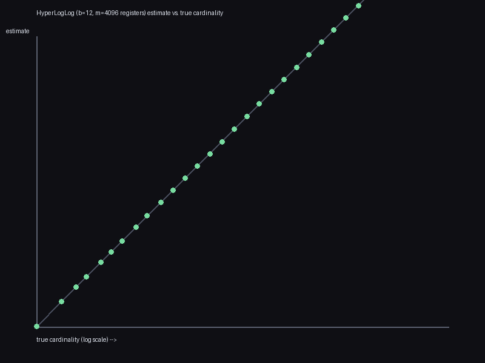

# probds

Three classic probabilistic data structures, from scratch: a Bloom
filter (approximate set membership), a Count-Min Sketch (approximate
frequency counting), and HyperLogLog (approximate cardinality
estimation). Each trades a small, mathematically-quantified error rate
for sublinear memory. `probds/` has zero dependencies; `main.py` uses
Pillow only to draw a chart.

```bash
python3 main.py --seed 1 --output hll_convergence.png
```



HyperLogLog's estimate (green dots) tracked the true cardinality (the
faint diagonal) closely across four orders of magnitude, from single
digits to tens of thousands of distinct items, using only 4096
registers regardless of how large the count got.

## The correctness proof: each structure's *own* theoretical bound, checked against reality

Unlike most other things in this collection, these data structures are
*supposed* to be wrong sometimes — that's the entire trade they make for
sublinear memory. So the proof isn't "matches an oracle exactly"; it's
"the actual error rate matches the closed-form formula the structure's
own theory predicts," checked empirically:

- **Bloom filter** (`bloom_filter.py`): false negatives are structurally
  impossible (a member's own bits are always set by its own insertion),
  checked directly across 120 randomized trials. False positives are
  checked against the filter's *own* prediction from its actual bit-array
  fill ratio — `(fraction of bits set)^k` — over 20,000 fresh non-member
  queries per trial, across a spread of sizes and target rates from 1%
  to 10%, and required to land within a generous statistical tolerance
  of that prediction.
- **Count-Min Sketch** (`count_min_sketch.py`): never underestimates a
  true count (checked against `collections.Counter` as an exact oracle
  across 150 randomized streams, both uniform and Zipf-skewed) — a
  structural guarantee, not a probabilistic one, since a counter can
  only be inflated by collisions, never deflated. The *overestimate* is
  checked to stay within a generous multiple of the theoretical
  `epsilon * total_count` bound implied by the sketch's own
  `for_error_bound(epsilon, delta)` sizing.
- **HyperLogLog** (`hyperloglog.py`): estimated cardinality is checked
  against the true distinct count across a spread of register counts (b
  = 8, 10, 12) and true cardinalities (200 to 20,000), landing within a
  generous multiple of the structure's own predicted standard error,
  `1.04/sqrt(m)`. A separate test cross-checks the *shape* of that
  claim, not just individual trials: averaged relative error over many
  trials shrinks as `m` grows, in the direction the formula predicts.
  Duplicate insertions are checked to leave the estimate unchanged
  (HyperLogLog counts distinct items, not stream length).

## A real bug this cross-checking caught

The first version of `count_min_sketch.py` reused `bloom_filter.py`'s
hashing trick — the Kirsch-Mitzenmacher double-hashing scheme, where `d`
"row" hash functions are synthesized as `g_i(x) = h1(x) + i * h2(x) mod
width` from just two real hashes. That's a well-established, valid
substitute for `k` independent hash functions *for Bloom filters*. It is
**not** valid for a count-min sketch's row hashes, and a test with a
Zipf-skewed stream (a few very heavy items, many rare ones) caught it
directly: `key-282`, with a true count of 13, was estimated at 3707 —
wildly outside even a generous 3x safety margin on the theoretical
error bound.

The reason: `g_i(x) = g_i(y)` for two different items `x, y` iff
`(h1_x - h1_y) + i*(h2_x - h2_y) ≡ 0 (mod width)`, a *linear* equation
in the row index `i`. If two items happen to collide in row 0 (`h1_x ≡
h1_y`) **and** have `h2_x ≡ h2_y (mod width)`, the row-index term
vanishes entirely and they collide in *every single row*, not just one —
exactly the correlated-failure mode the whole "take the minimum across
independent rows" design is supposed to rule out. With a small width
(55, for `epsilon=0.05`), this isn't a rare coincidence: `key-282`
collided with a heavy hitter on all 3 rows simultaneously, and the
minimum across 3 correlated bad rows is just as bad as any one of them.

The fix (`hashing.row_hash`): give each row a hash computed from a
fresh, independent input — the item concatenated with the row index,
rehashed from scratch — rather than a cheap linear variation on two
shared base hashes. `bloom_filter.py` still uses the original
Kirsch-Mitzenmacher trick (`hashing.kth_hash`), correctly, since a Bloom
filter's proof doesn't depend on cross-row independence between two
different items the way Count-Min Sketch's does.

## Architecture

```
probds/
  hashing.py            kth_hash (Kirsch-Mitzenmacher, for Bloom filters)
                          row_hash (independent per-row, for Count-Min Sketch)
  bloom_filter.py        BloomFilter
  count_min_sketch.py    CountMinSketch
  hyperloglog.py         HyperLogLog
```

## Usage

```python
from probds import BloomFilter, CountMinSketch, HyperLogLog

bf = BloomFilter(expected_items=10_000, false_positive_rate=0.01)
bf.add("alice@example.com")
"alice@example.com" in bf          # True, always
"bob@example.com" in bf            # False, with ~99% probability

cms = CountMinSketch.for_error_bound(epsilon=0.001, delta=0.01)
cms.add("the", count=1)
cms.estimate("the")                 # >= true count, always

hll = HyperLogLog(b=12)
for x in range(100_000):
    hll.add(x)
hll.estimate()                      # close to 100,000
```

## Tests

```bash
pip install -r requirements.txt
python3 -m pytest
```

366 tests: no-false-negative and empirical-false-positive-rate checks
for the Bloom filter across 120+ randomized trials, never-underestimate
and bounded-overestimate checks for Count-Min Sketch against an exact
`Counter` oracle, and standard-error-bounded cardinality checks for
HyperLogLog across a grid of register counts, true cardinalities, and
seeds — plus the row-hashing regression coverage for the bug above.

## Possible expansions

- A Counting Bloom filter (adds deletion support via small counters
  instead of single bits) cross-checked against a plain Bloom filter for
  membership agreement before any deletions happen
- A Cuckoo filter, which claims better space efficiency than Bloom
  filters at the same false-positive rate — a good target for a direct
  empirical comparison on the same datasets
- HyperLogLog's sparse representation (for small cardinalities, storing
  actual (index, rank) pairs instead of a dense register array) with a
  cross-check that it agrees exactly with the dense version before the
  switchover threshold
