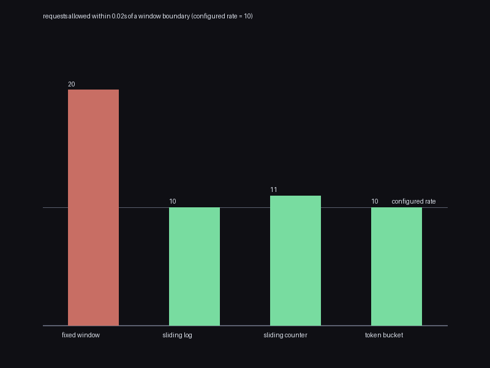

# ratelimit

Four rate limiting algorithms from scratch, all driven by an explicit
virtual clock (`allow(now)`) instead of a real one, so tests can
simulate hours of traffic instantly and deterministically.
`ratelimit/` has zero dependencies; `main.py` uses Pillow only to draw
a chart.

```bash
python3 main.py --output boundary_burst.png
```

```
[ratelimit] rate=10, window=10.0s -- requests allowed in a 0.02s span straddling a boundary:
  fixed window        20  (configured rate: 10)
  sliding log         10  (configured rate: 10)
  sliding counter     11  (configured rate: 10)
  token bucket        10  (configured rate: 10)
```



## The correctness proof: quantified trade-offs, not just descriptions

Rate limiter algorithms are usually compared qualitatively ("fixed
window is simple but has a boundary problem"). Here every claim is a
number, measured from an actual run:

- **`FixedWindowCounter`'s boundary flaw is demonstrated, not just
  described**: saving up `rate` requests for the instant before a
  window boundary and `rate` more for the instant after lets exactly
  `2 * rate` through in a real time span of 0.02 seconds — measured
  directly above, and checked as a hard equality in
  `test_boundary_burst_allows_close_to_double_the_rate`. Within a
  single window, though, it's exact:
  `test_total_allowed_in_one_window_never_exceeds_rate_regardless_of_arrival_pattern`
  checks `min(rate, requests)` allowed across 100 randomized arrival
  patterns.
- **`SlidingWindowLog` is proven correct against its own decision log,
  not just plausible**: after simulating a randomized request stream,
  `test_never_exceeds_rate_in_any_trailing_window` independently
  re-scans the *recorded* allowed timestamps (no deque, no incremental
  pruning, just direct pairwise comparison) and confirms no window of
  length `window_size` ever contains more than `rate` of them — across
  150 randomized traffic patterns. On the identical boundary-straddling
  scenario that breaks the fixed window, it correctly allows only
  `rate` (with one timestamp's worth of boundary-convention slack).
- **`TokenBucket`'s long-run throughput matches `rate * duration`
  tightly** when demand is dense relative to `1/rate` (checked across
  30 randomized (rate, capacity) pairs) — but a genuinely interesting,
  non-obvious consequence of what `capacity` means surfaced while
  writing that test (see below).
- **`SlidingWindowCounter`'s approximation quality is measured, not
  assumed**: under normal load (well under capacity) it agrees with the
  exact `SlidingWindowLog` on essentially every decision (>95% across
  100 randomized trials). Under sustained overload, agreement drops
  substantially — from ~99.9% at 30% load down to well under 85% at 2x
  overload, measured directly. That's the *opposite* of reassuring
  intuition (you'd hope an approximation degrades gracefully exactly
  when it matters most), which is precisely why it's checked and
  reported rather than assumed away — even though the *aggregate*
  throughput stays close to the exact log's throughout
  (`test_never_wildly_overcounts_relative_to_exact_log`).

## A real finding, not a bug: token bucket's capacity ceiling silently costs throughput

An early version of the token bucket throughput test failed with a
~2% throughput deficit that didn't shrink as the simulated duration
grew — a real, systematic effect, not noise or a transient. Digging in
with direct instrumentation confirmed the cause exactly: the test's
`capacity` was occasionally close to 1, and its random request gaps
were occasionally long enough that *more than `capacity` worth of
tokens* would have accumulated between two consecutive requests. A
token bucket correctly discards refill beyond `capacity` — that's the
literal definition of a burst cap — so that "wasted" accumulation is
gone forever, not banked forward. Summing the clipped amount across the
whole run accounted for the missing throughput almost exactly.

This isn't a bug in `token_bucket.py`; it's a real and slightly
counterintuitive property worth knowing: **a small `capacity` doesn't
just cap burst size, it also silently costs long-run throughput
whenever demand has any gaps at all**, even brief ones — because every
gap is a chance for refill to accumulate past the ceiling and vanish.
The original test's tolerance assumption was wrong for not accounting
for this. Fixed two ways: the throughput test now uses request gaps
tiny enough (relative to `1/rate`) that clipping is negligible, and a
new test, `test_small_capacity_measurably_costs_throughput_when_demand_has_gaps`,
demonstrates the effect directly and confirms it shrinks as `capacity`
grows — turning what could have been a quietly loosened tolerance into
a documented, checked property instead.

## Architecture

```
ratelimit/
  token_bucket.py           TokenBucket
  fixed_window.py            FixedWindowCounter
  sliding_window_log.py      SlidingWindowLog (the "exact" one)
  sliding_window_counter.py  SlidingWindowCounter (O(1)-space approximation)
```

## Usage

```python
from ratelimit import TokenBucket, SlidingWindowLog

limiter = TokenBucket(rate=100.0, capacity=200)   # 100 req/s, burst up to 200
limiter.allow(now=12.5)   # True/False -- caller supplies the clock

log = SlidingWindowLog(rate=100, window_size=60.0)  # 100 req / rolling minute
log.allow(now=12.5)
```

## Tests

```bash
pip install -r requirements.txt
python3 -m pytest
```

596 tests: the brute-force trailing-window re-verification for the
sliding log, the boundary-burst measurement for all three
window-based limiters on the identical scenario, the token-bucket
throughput and capacity-clipping tests, and the sliding-window
counter's normal-load vs. overload agreement measurements against the
exact log.

## Possible expansions

- A distributed variant (e.g. token bucket state shared via a
  key-value store with compare-and-swap) with a check that concurrent
  clients still can't exceed the aggregate rate — a good target to pair
  with `kvstore` or `crdt` from this collection
- A leaky bucket (queues excess requests instead of rejecting them
  outright) compared directly against token bucket on identical bursty
  traffic
- Per-key rate limiting (e.g. one bucket per API key) backed by
  `chash`'s consistent hashing ring, to shard limiter state across
  multiple nodes without every node needing every key's state
