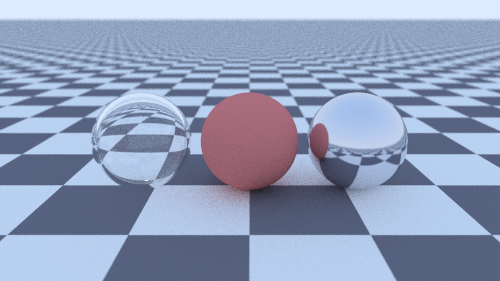
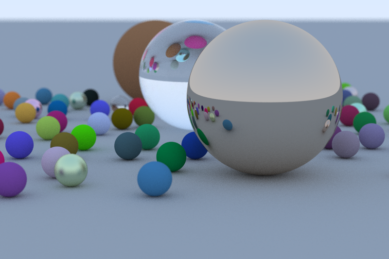

# raytracer

A ray tracer written from scratch in Python — no rendering libraries, just
vector math and physics. It supports:

- Spheres and infinite (optionally checkerboard) planes
- Three material types: diffuse (Lambertian), metal (with adjustable
  fuzziness), and dielectric (glass, with real Fresnel-based
  reflect/refract via Schlick's approximation)
- Soft shadows and reflections that fall out naturally from recursive
  path tracing (no special-cased shadow rays)
- Anti-aliasing via multi-sampling per pixel
- Depth of field via a thin-lens camera model
- Multi-process rendering (one worker per CPU core by default)
- A PNG writer — uses Pillow if installed, otherwise falls back to a
  small hand-rolled PNG encoder built on stdlib `zlib` only

This follows the general approach of Peter Shirley's *Ray Tracing in One
Weekend*, implemented independently in idiomatic Python with a proper test
suite.

## Example renders

`three_spheres` — a diffuse sphere, a hollow glass sphere, and a metal
sphere on a checkered floor:



`random_field` — a field of small randomly-generated spheres around three
feature spheres:



## Usage

```bash
pip install -r requirements.txt

# quick preview
python3 main.py --scene three_spheres --width 300 --samples 10 --output preview.png

# higher quality
python3 main.py --scene random_field --width 800 --samples 200 --depth 20 --output render.png
```

Options (`python3 main.py --help`):

| Flag | Meaning |
|---|---|
| `--scene` | `three_spheres` or `random_field` |
| `--width` / `--height` | image size in pixels (`--height` defaults from aspect ratio) |
| `--samples` | samples per pixel (higher = less noise, slower) |
| `--depth` | max ray bounce depth |
| `--seed` | RNG seed, for reproducible renders |
| `--workers` | number of parallel processes (default: one per CPU) |
| `--output` | output PNG path |

## Architecture

```
raytracer/
  vec3.py        Vec3: vector/color math, reflection, refraction, sampling helpers
  ray.py         Ray: origin + direction
  camera.py      Camera: thin-lens camera producing rays for (u, v) viewport coords
  hittable.py    Sphere, Plane, HittableList: ray-object intersection
  materials.py   Lambertian, Metal, Dielectric: how surfaces scatter light
  render.py      ray_color() recursive path tracing + parallel render()
  png_writer.py  PNG output (Pillow or pure-stdlib fallback)
  scenes.py      example scene setups
```

`ray_color()` is the core recursive loop: cast a ray, find the closest hit,
ask its material how the ray scatters, and recurse — attenuating color at
each bounce — until it escapes to the sky or hits the depth limit.

## Tests

```bash
python3 -m pytest
```

35 tests cover vector math, ray/object intersection (including edge cases
like rays starting inside a sphere, or missing entirely), camera ray
generation, material scattering behavior, and end-to-end rendering
(dimensions, determinism given a seed, PNG round-tripping through both
writer paths).

## Possible expansions

- Triangle meshes + OBJ loading
- Bounding volume hierarchy for faster intersection on complex scenes
- Textures (image-mapped, procedural noise)
- Area lights / importance sampling for faster convergence
- Motion blur
