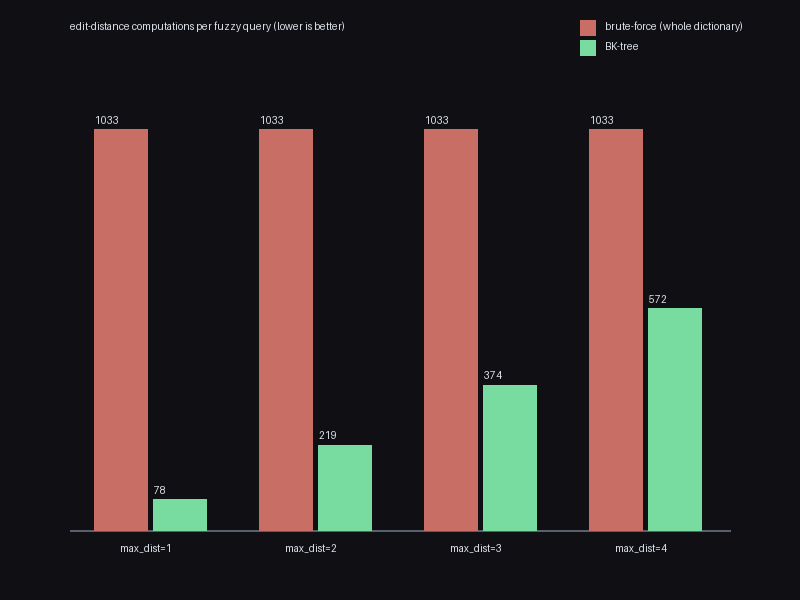

# spellcheck

A spell-checker/autocomplete engine from scratch: Levenshtein edit
distance, a trie for exact lookup and prefix autocomplete, and a
BK-tree for fuzzy "did you mean" suggestions that exploits the triangle
inequality to avoid scanning the whole dictionary. `spellcheck/` has
zero dependencies; `main.py` uses Pillow only to draw a chart.

```bash
python3 main.py --output pruning_comparison.png
```

```
recieve      -> believe (2), receive (2)
wich         -> rich (1), which (1), wish (1), with (1), each (2)
langauge     -> language (2)
goverment    -> government (1)
freind       -> find (2), friend (2)

[pruning] edit-distance computations for a fuzzy query, by max_dist:
  max_dist=1:  BK-tree=   78   brute-force= 1033   (13.2x fewer)
  max_dist=2:  BK-tree=  219   brute-force= 1033   (4.7x fewer)
  max_dist=3:  BK-tree=  374   brute-force= 1033   (2.8x fewer)
  max_dist=4:  BK-tree=  572   brute-force= 1033   (1.8x fewer)
```



## The correctness proof: a real mathematical law enables real pruning

- **Levenshtein distance** (`edit_distance.py`) is checked against an
  independently-coded, unmemoized recursive brute-force version of the
  same textbook recurrence across 300 randomized short-string pairs, and
  against three properties that make it a genuine *metric*, not just a
  useful heuristic: symmetry (`d(a,b) == d(b,a)`), identity of
  indiscernibles (`d(a,a) == 0`), and — the one that actually matters for
  the rest of this thing — the **triangle inequality**,
  `d(a,c) <= d(a,b) + d(b,c)`, checked numerically across 300 random
  string triples.
- **The triangle inequality is what makes the BK-tree's pruning valid**,
  not just fast in practice: a child keyed by distance `k` from its
  parent can only contain words at distance `>= |k - queried_distance|`
  from the query, so any child where that lower bound exceeds
  `max_dist` can be skipped with a *provable* guarantee of missing
  nothing — not a heuristic that happens to usually work.
  `test_query_matches_brute_force_linear_scan` (150 randomized trials)
  checks that the pruned search returns *exactly* the same set a full
  linear scan of the dictionary would, so the pruning's cheapness never
  comes at the cost of a missed suggestion. The chart above shows the
  resulting cost directly: at `max_dist=1`, the BK-tree needs about 13x
  fewer edit-distance computations than scanning the whole dictionary —
  a real, measured number from an actual run, not a theoretical
  estimate.
- **Trie autocomplete** is checked against a brute-force
  `[w for w in dictionary if w.startswith(prefix)]` scan across 150
  randomized (dictionary subset, prefix) pairs, and trie membership is
  checked against a plain Python `set` across 100 trials.

## A test bug this cross-checking caught

`test_suggest_ranks_closest_first` originally asserted that correcting
`"recieve"` against the full dictionary uniquely suggests `"receive"`
first. It failed — the top suggestion came back as `"believe"`. Not a
bug in `suggest()`: `"believe"` and `"receive"` are **both** exactly
distance 2 from `"recieve"` (`b`/`r` and `l`/`c` are each one
substitution away), a genuine tie that the ranking breaks
alphabetically, and `"believe"` sorts before `"receive"`. The test's
assumption — that there'd be a unique closest match — was simply wrong
for this particular dictionary. Fixed by testing uniqueness against a
small controlled word list where "receive" really is alone at the
top, and adding a separate test that checks tie-breaking is at least
deterministic (alphabetical) on the full dictionary where ties exist.

## Architecture

```
spellcheck/
  edit_distance.py    levenshtein (DP), levenshtein_recursive_bruteforce
  trie.py              Trie: insert, __contains__, autocomplete
  bk_tree.py           BKTree: insert, query (triangle-inequality pruning)
  spellchecker.py       SpellChecker: combines both into one API
  words.py              a ~1,000-word curated dictionary for the demo/tests
```

## Usage

```python
from spellcheck import SpellChecker, COMMON_WORDS

checker = SpellChecker(COMMON_WORDS)
checker.is_correct("language")            # True
checker.suggest("langauge", max_dist=2)    # [('language', 2)]
checker.autocomplete("lang")               # ['language']
```

## Tests

```bash
pip install -r requirements.txt
python3 -m pytest
```

1,553 tests: the brute-force and metric-law checks for edit distance,
exact-match cross-checks against Python's `set` and brute-force scans
for the trie, exact-match cross-checks against a brute-force linear
scan for the BK-tree (the pruning's actual correctness guarantee, not
just its speed), plus the tie-breaking regression coverage above.

## Possible expansions

- A weighted-edit-distance variant (keyboard-adjacency-aware
  substitution costs, so "teh" costs less to fix than an equally-far
  but keyboard-distant typo) with a check that it still satisfies the
  triangle inequality (needed for the BK-tree to stay valid at all)
- Damerau-Levenshtein distance (adds transposition as a single edit,
  so "recieve" -> "receive" becomes distance 1 instead of 2) — a good
  target for a second, independent cross-check dictionary of common
  transposition typos
- A soundex/metaphone phonetic index as a third suggestion strategy,
  compared directly against the BK-tree's edit-distance-based
  suggestions on the same typo set
